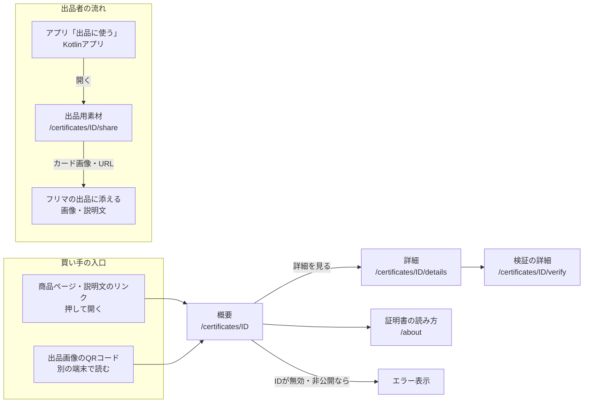

# 画面

MVPは7画面。買い手は出品のリンクやQRから概要画面に、出品者はアプリから出品用素材ページに着地する。MVPではログイン不要。

## 画面一覧

| 画面 | パス | 内容 | 主な利用者 | 関連要件 |
| --- | --- | --- | --- | --- |
| 概要 | `/certificates/[ID]` | 最終計測日時、検証結果、届いた端末との照合、評価（準備中）、「詳細を見る」ボタン | 買い手 | FR-01、FR-02、FR-04、FR-05、FR-08、FR-19 |
| 詳細 | `/certificates/[ID]/details` | 最終計測日時、検証結果、届いた端末との照合、端末情報、推移グラフ、記録タイムライン | 買い手 | FR-01〜FR-03、FR-05、FR-06、FR-08、FR-18 |
| 出品用素材 | `/certificates/[ID]/share` | カード画像の保存、URLと説明文用テキストのコピー、公開設定の案内 | 出品者 | FR-11、FR-12 |
| 検証の詳細 | `/certificates/[ID]/verify` | 記録ごとの連番・ハッシュ・照合結果・チェーンへの記録状態 | 買い手 | FR-09、FR-10 |
| トップ | `/` | サービス説明と、証明書の開き方の案内 | 両方 | ― |
| 証明書の読み方 | `/about` | 評価の見方と、ブロックチェーンで保証できること・できないこと | 両方 | FR-04 |
| エラー | `/certificates/[ID]` 内で表示 | 見つからない・非公開・一時的に取得できないの案内 | 買い手 | FR-01 |

出品用素材ページは誰でも開けるが、出品先の登録はアプリ側で行う。

メニューやサイドバーは置かず、画面の移動は各画面のボタンとリンクで行う（[decisions/0012](decisions/0012-remove-bookmark-and-sidebar.md)）。

## 画面遷移

```mermaid
flowchart LR
    subgraph entry[買い手の入口]
        LINK[商品ページ・説明文のリンク<br>押して開く]
        QR[出品画像のQRコード<br>別の端末で読む]
    end
    OVERVIEW[概要<br>/certificates/ID]
    DETAIL[詳細<br>/certificates/ID/details]
    VERIFY[検証の詳細<br>/certificates/ID/verify]
    ABOUT[証明書の読み方<br>/about]
    ERR[エラー表示]

    LINK --> OVERVIEW
    QR --> OVERVIEW
    OVERVIEW -- 詳細を見る --> DETAIL
    DETAIL --> VERIFY
    OVERVIEW --> ABOUT
    OVERVIEW -- IDが無効・非公開なら --> ERR

    subgraph seller[出品者の流れ]
        APP[アプリ「出品に使う」<br>Kotlinアプリ]
        SHARE[出品用素材<br>/certificates/ID/share]
        FURIMA[フリマの出品に添える<br>画像・説明文]
    end
    APP -- 開く --> SHARE
    SHARE -- カード画像・URL --> FURIMA
```

## 概要

QRコードやURLで最初に開く画面（FR-19）。スマホに詳しくない人でも、最初の1画面で、いつ時点の記録か・検証結果・「届いた端末か」を判断できるようにする。専門用語を避け、グラフや記録の表は出さない。PCでは、結論を横長の枠の中に「機種・最終計測と記録期間・検証結果」の順で並べ、その下の段に「評価」（左）と「届いた端末との照合」（右）を同じ高さで並べる。「詳細を見る」は最下段の右に置く。

| 順 | 区分 | 項目 | 表示の仕方 |
| --- | --- | --- | --- |
| 1 | 警告 | デモ用の架空のデータであること | `is_demo` が true のときだけ内容より上に出す |
| 2 | 結論 | 機種名、最終計測日時、記録期間・件数、検証結果 | 大きめの文字で出す。「最終計測」を目立たせ、リアルタイムの状態ではないことを添える（[decisions/0014](decisions/0014-show-latest-device-state.md)）。検証結果は一致・不一致・照合できずを区別し、件数は出さない |
| 3 | 届いた端末との照合 | IMEIの入力欄と照合結果 | 届いた端末で *#06# を押して出たIMEIを入れてもらう（[decisions/0015](decisions/0015-imei-input-check.md)）。出品先の表示は Back の実装後に足す |
| 4 | 評価 | 総合評価と項目別（バッテリー・発熱・安定性）の評価と説明文 | Back が返すまでは「評価は準備中」と出し、仮の値で埋めない。返るようになったら説明文をそのまま出す |
| 5 | 次の行動 | 「詳細を見る」ボタン、証明書の読み方へのリンク | 目立つボタンで詳細画面へ。証明できる範囲の注意を1行添え、一番下に「証明書の読み方はこちら」を置く（FR-04） |

## 詳細

「詳細を見る」で開く、すべての情報を載せた画面。上から「結論→出品との照合→根拠→詳細」の順に並べる。

| 順 | 区分 | 項目 | 表示の仕方 |
| --- | --- | --- | --- |
| 1 | 結論 | 機種名、最終計測日時、記録期間・記録件数、検証結果（一致・不一致・照合できず） | 記録期間が短い場合は注意書きを出す。検証結果は一致ならバッジだけにし、記録数と照合日時は検証の詳細画面で見せる。不一致・照合できずは理由と次の行動（詳細を見る・再試行）まで出す。デモのデータは内容より上に警告で出す。色だけで良し悪しを表さない |
| 2 | 届いた端末との照合 | IMEIの入力欄と照合結果 | 概要と同じ |
| 3 | 端末情報 | メーカー、モデル、端末名、SoC、CPUコア数、RAM、ストレージ、画面サイズ・密度、Android（spec の値） | 仕様表。spec の取得日を添える。RAM・ストレージは bytes を GB に丸める。値がなければ「不明」 |
| 4 | バッテリー | 推定最大電荷、記録開始時からの変化（%）、サイクルカウント | 数値＋推定最大電荷の推移グラフ |
| 5 | 発熱 | 最高温度、45℃を超えた回数、熱的余裕の最大値 | 数値＋温度と熱的余裕の推移グラフ（目安の線つき） |
| 6 | 安定性 | 累計起動回数、異常終了があった記録 | 数値＋異常終了の日付一覧＋1週間あたりの起動回数の棒グラフ |
| 7 | OSの更新履歴 | Android OSバージョン・SDKが変わった記録 | 表 |
| 8 | 評価の根拠 | 項目別（バッテリー・発熱・安定性）の評価と説明文 | 「なぜこの評価か」を項目ごとに1〜2文で。Back が返すまでは「準備中」 |
| 9 | 記録の一覧 | 最も空いた記録の間隔、全記録の値（充放電サイクル回数・残り電荷を含む） | 欠測のしきい値が決まるまでは「途切れた」と断定しない。全記録の表は折りたたみ。null は「不明」 |
| 10 | 整備記録 | 事業者による修理・点検の記録。記録者（事業者名と種別）・日時・内容 | アプリの自動記録と見た目で区別する（FR-18）。書き込みは別リポジトリの事業者向けサイト。Back が返すまでは「準備中」 |
| 11 | 注意事項 | 証明できること・できないこと、リアルタイムの状態ではないこと、ブロックチェーン未記録であること | 固定文。/about へのリンク |

注意事項の中身は [security.md](security.md) の信頼モデルに合わせる。

## 出品用素材

カード画像のプレビューと保存ボタン、URLのコピー、説明文用テキストのコピー、公開設定の案内を1画面に並べる。中身と仕様は [features/qr.md](features/qr.md)。

## 検証の詳細

記録ごとに、連番・種別・記録時刻・ブラウザで計算したハッシュ・保存されているハッシュ・照合結果・チェーンへの記録状態を並べ、canonical_payload のダウンロード（FR-10）を置く。チェーンが決まったら、トランザクションとエクスプローラーへのリンクを足す。検証の仕組みは [features/verification.md](features/verification.md)。

## トップ

サービスの説明と、証明書は出品のリンクやQRから開くことを案内する。証明書番号はないので、入力欄は置かない（[decisions/0010](decisions/0010-url-and-qr-only.md)）。

## エラー表示

| 状態 | 表示 |
| --- | --- |
| 存在しない・非公開・形式が不正なID（Back の 400・404） | 「この証明書は見つからないか、非公開に設定されています」。URLが途中で切れていないかの確認と、出品ページのリンクから開き直す案内。HTTP 404 |
| 通信エラー・429・5xx | 「一時的に表示できません」と再読み込みの案内。「見つからない」や検証の「不一致」とは別の表示 |
